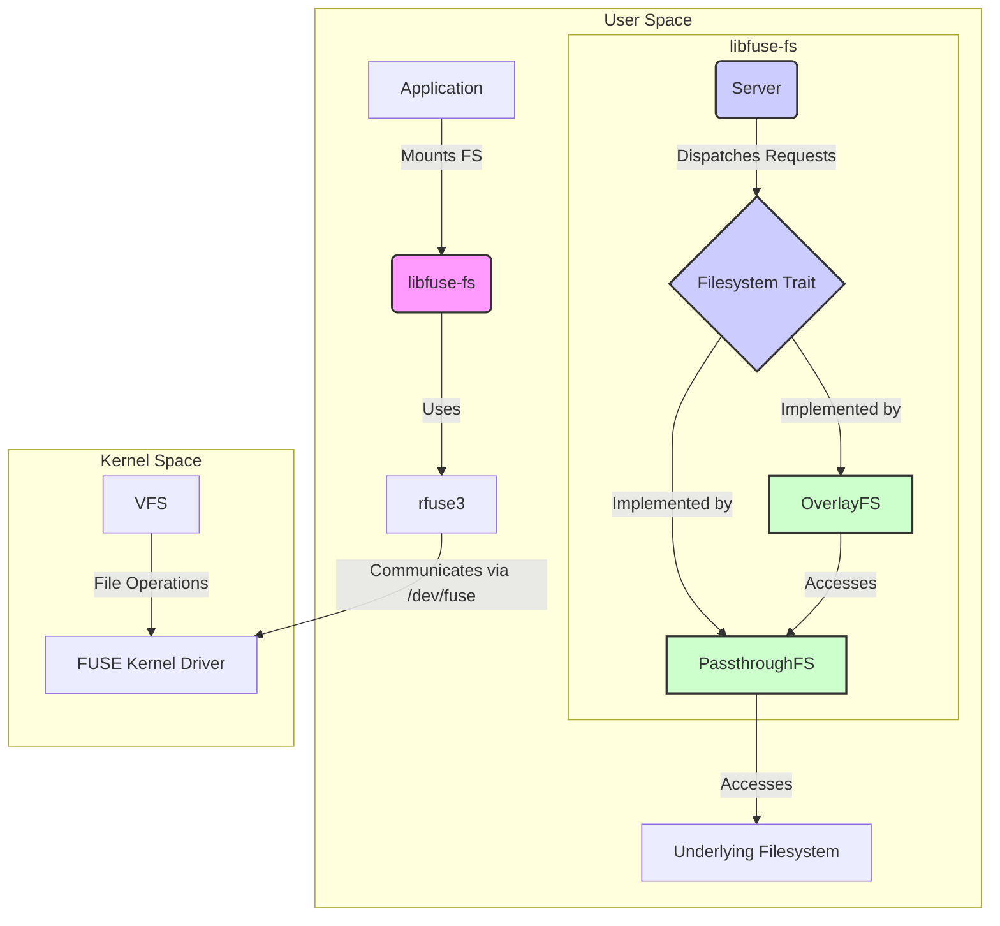
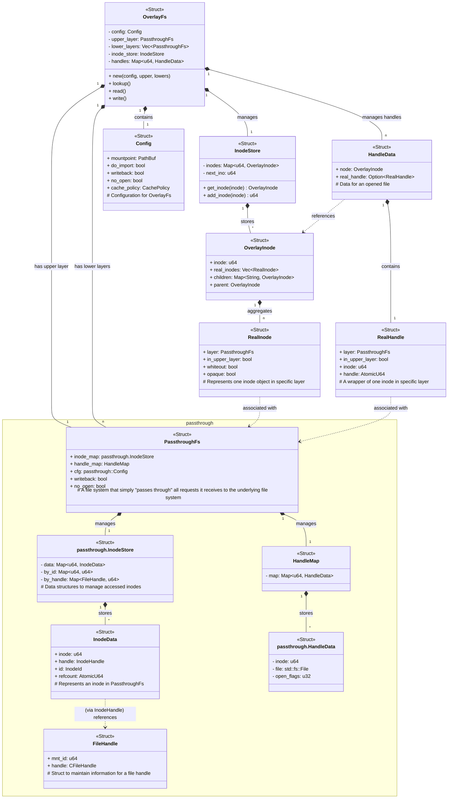
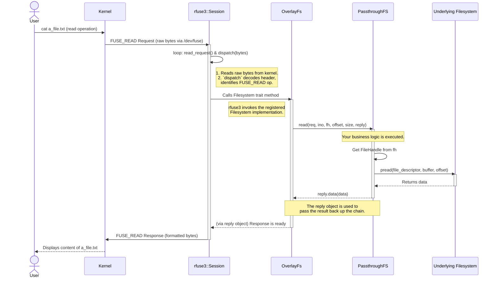

## High level architecture

```mermaid
graph TD
    subgraph User Space
        A[Application] -- Mounts FS --> B(libfuse-fs)
        subgraph libfuse-fs
            C(Server) -- Dispatches Requests --> D{Filesystem Trait}
            D -- Implemented by --> E[PassthroughFS]
            D -- Implemented by --> F[OverlayFS]
            F -- Accesses --> E
        end
        E -- Accesses --> G[Underlying Filesystem]
        B -- Uses --> H[rfuse3]
    end

    subgraph Kernel Space
        I[VFS] -- File Operations --> J[FUSE Kernel Driver]
    end

    H -- Communicates via /dev/fuse --> J

    style B fill:#f9f,stroke:#333,stroke-width:2px
    style C fill:#ccf,stroke:#333,stroke-width:2px
    style D fill:#ccf,stroke:#333,stroke-width:2px
    style E fill:#cfc,stroke:#333,stroke-width:2px
    style F fill:#cfc,stroke:#333,stroke-width:2px
```

## Key data structures

```mermaid
classDiagram
    direction TB

    class OverlayFs {
        <<Struct>>
        - config: Config
        - upper_layer: PassthroughFs
        - lower_layers: Vec&lt;PassthroughFs&gt;
        - inode_store: InodeStore
        - handles: Map&lt;u64, HandleData&gt;
        + new(config, upper, lowers)
        + lookup()
        + read()
        + write()
    }

    class InodeStore {
        <<Struct>>
        - inodes: Map&lt;u64, OverlayInode&gt;
        - next_ino: u64
        + get_inode(inode) OverlayInode
        + add_inode(inode) u64
    }

    class OverlayInode {
        <<Struct>>
        + inode: u64
        + real_inodes: Vec&lt;RealInode&gt;
        + children: Map&lt;String, OverlayInode&gt;
        + parent: OverlayInode
    }

    class RealInode {
        <<Struct>>
        + layer: PassthroughFs
        + in_upper_layer: bool
        + whiteout: bool
        + opaque: bool
        # Represents one inode object in specific layer
    }

    class HandleData {
        <<Struct>>
        + node: OverlayInode
        + real_handle: Option&lt;RealHandle&gt;
        # Data for an opened file
    }

    class RealHandle {
        <<Struct>>
        + layer: PassthroughFs
        + in_upper_layer: bool
        + inode: u64
        + handle: AtomicU64
        # A wrapper of one inode in specific layer
    }
    
    class Config {
        <<Struct>>
        + mountpoint: PathBuf
        + do_import: bool
        + writeback: bool
        + no_open: bool
        + cache_policy: CachePolicy
        # Configuration for OverlayFs
    }
    
   namespace passthrough {
        class PassthroughFs {
            <<Struct>>
            + inode_map: passthrough.InodeStore
            + handle_map: HandleMap
            + cfg: passthrough::Config
            + writeback: bool
            + no_open: bool
            # A file system that simply "passes through" all requests it receives to the underlying file system
        }
    
        class passthrough.InodeStore {
            <<Struct>>
            - data: Map&lt;u64, InodeData&gt;
            - by_id: Map&lt;u64, u64&gt;
            - by_handle: Map&lt;FileHandle, u64&gt;
            # Data structures to manage accessed inodes
        }

        class InodeData {
            <<Struct>>
            + inode: u64
            + handle: InodeHandle
            + id: InodeId
            + refcount: AtomicU64
            # Represents an inode in PassthroughFs
        }

        class HandleMap {
            <<Struct>>
            - map: Map&lt;u64, HandleData&gt;
        }
        
        class passthrough.HandleData {
        	<<Struct>>
        	- inode: u64
        	- file: std::fs::File
        	- open_flags: u32
        }

        class FileHandle {
            <<Struct>>
            + mnt_id: u64
            + handle: CFileHandle
            # Struct to maintain information for a file handle
        }
    }

    %% Relationships
    OverlayFs "1" *-- "1" Config : contains
    OverlayFs "1" *-- "1" PassthroughFs : has upper layer
    OverlayFs "1" *-- "n" PassthroughFs : has lower layers
    OverlayFs "1" *-- "1" InodeStore : manages
    OverlayFs "1" *-- "n" HandleData : manages handles

    InodeStore "1" *-- "*" OverlayInode : stores

    OverlayInode "1" *-- "n" RealInode : aggregates

    HandleData "1" *-- "1" RealHandle : contains
    HandleData ..> OverlayInode : references

    RealInode ..> PassthroughFs : associated with
    RealHandle ..> PassthroughFs : associated with
    
    PassthroughFs "1" *-- "1" passthrough.InodeStore : manages
    PassthroughFs "1" *-- "1" HandleMap : manages

    passthrough.InodeStore "1" *-- "*" InodeData : stores
    HandleMap "1" *-- "*" passthrough.HandleData : stores

    InodeData ..> FileHandle : (via InodeHandle) references
```

## File read flow

```mermaid
sequenceDiagram
    actor User
    participant Kernel
    participant rfuse3 as rfuse3::Session
    participant Server as OverlayFs
    participant PassthroughFS
    participant UnderlyingFS as Underlying Filesystem

    %% -- Initialization (Conceptual) --
    %% Server->>rfuse3: Create Session(mountpoint, PassthroughFS)
    %% Server->>rfuse3: session.run()

    %% -- Read Operation Flow --
    User->>Kernel: cat a_file.txt (read operation)
    Kernel->>rfuse3: FUSE_READ Request (raw bytes via /dev/fuse)
    activate rfuse3

    rfuse3->>rfuse3: loop: read_request() & dispatch(bytes)
    note right of rfuse3: 1. Reads raw bytes from kernel.<br>2. `dispatch` decodes header,<br>identifies FUSE_READ op.

    %% This call is conceptual. In reality, rfuse3 calls the trait method directly.
    %% The 'Server' role here represents the application logic layer that rfuse3 serves.
    rfuse3->>Server: Calls Filesystem trait method
    activate Server
    note left of Server: rfuse3 invokes the registered<br>Filesystem implementation.

    Server->>PassthroughFS: read(req, ino, fh, offset, size, reply)
    activate PassthroughFS
    note over PassthroughFS: Your business logic is executed.

    PassthroughFS->>PassthroughFS: Get FileHandle from fh
    PassthroughFS->>UnderlyingFS: pread(file_descriptor, buffer, offset)
    activate UnderlyingFS

    UnderlyingFS-->>PassthroughFS: Returns data
    deactivate UnderlyingFS

    PassthroughFS-->>Server: reply.data(data)
    deactivate PassthroughFS
    note over Server, PassthroughFS: The reply object is used to<br>pass the result back up the chain.

    Server-->>rfuse3: (via reply object) Response is ready
    deactivate Server

    rfuse3->>Kernel: FUSE_READ Response (formatted bytes)
    deactivate rfuse3

    Kernel-->>User: Displays content of a_file.txt
```
