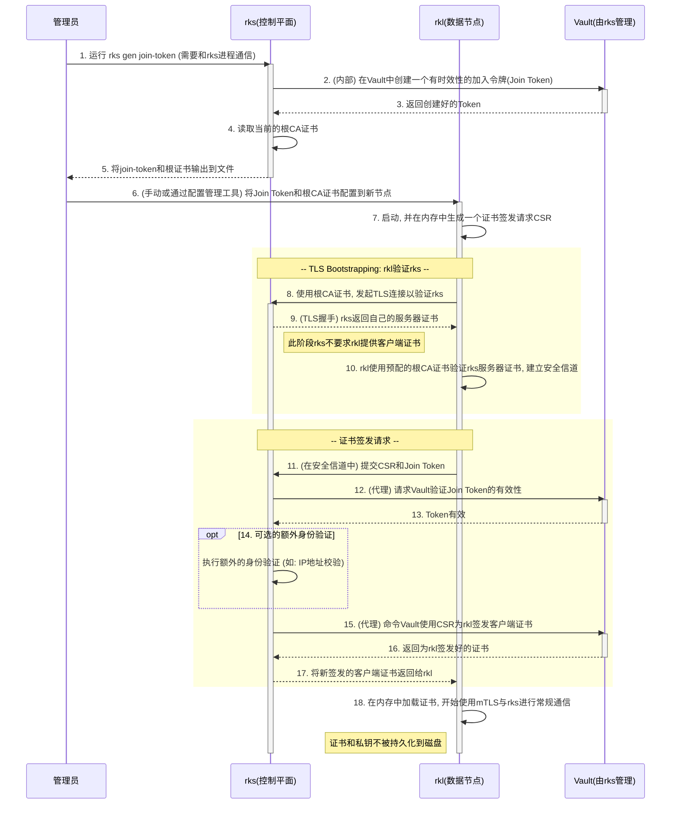
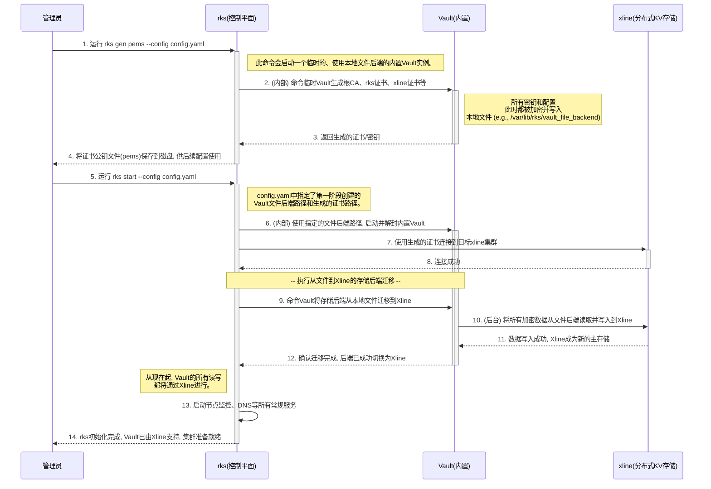

The `libvault` serves as the certificate manager in rk8s.

## RKS initialization 

```mermaid
sequenceDiagram
participant 管理员
participant rks(控制平面)
participant rkl(数据节点)
participant Vault(由rks管理)

    管理员->>rks(控制平面): 1. 运行 rks gen join-token (需要和rks进程通信)
    activate rks(控制平面)
    rks(控制平面)->>Vault(由rks管理): 2. (内部) 在Vault中创建一个有时效性的加入令牌(Join Token)
    activate Vault(由rks管理)
    Vault(由rks管理)-->>rks(控制平面): 3. 返回创建好的Token
    deactivate Vault(由rks管理)
    rks(控制平面)->>rks(控制平面): 4. 读取当前的根CA证书
    rks(控制平面)-->>管理员: 5. 将join-token和根证书输出到文件
    deactivate rks(控制平面)

    管理员->>rkl(数据节点): 6. (手动或通过配置管理工具) 将Join Token和根CA证书配置到新节点
    activate rkl(数据节点)
    rkl(数据节点)->>rkl(数据节点): 7. 启动, 并在内存中生成一个证书签发请求CSR

    rect rgb(255, 255, 224)
        note over rkl(数据节点),rks(控制平面): -- TLS Bootstrapping: rkl验证rks --
        rkl(数据节点)->>rks(控制平面): 8. 使用根CA证书, 发起TLS连接以验证rks
        activate rks(控制平面)
        rks(控制平面)-->>rkl(数据节点): 9. (TLS握手) rks返回自己的服务器证书
        note right of rks(控制平面): 此阶段rks不要求rkl提供客户端证书
        rkl(数据节点)->>rkl(数据节点): 10. rkl使用预配的根CA证书验证rks服务器证书, 建立安全信道
    end

    rect rgb(255, 255, 224)
        note over rkl(数据节点),rks(控制平面): -- 证书签发请求 --
        rkl(数据节点)->>rks(控制平面): 11. (在安全信道中) 提交CSR和Join Token
        rks(控制平面)->>Vault(由rks管理): 12. (代理) 请求Vault验证Join Token的有效性
        activate Vault(由rks管理)
        Vault(由rks管理)-->>rks(控制平面): 13. Token有效
        deactivate Vault(由rks管理)
        
        opt 14. 可选的额外身份验证
            rks(控制平面)->>rks(控制平面): 执行额外的身份验证 (如: IP地址校验)
        end

        rks(控制平面)->>Vault(由rks管理): 15. (代理) 命令Vault使用CSR为rkl签发客户端证书
        activate Vault(由rks管理)
        Vault(由rks管理)-->>rks(控制平面): 16. 返回为rkl签发好的证书
        deactivate Vault(由rks管理)
        
        rks(控制平面)-->>rkl(数据节点): 17. 将新签发的客户端证书返回给rkl
    end

    rkl(数据节点)->>rkl(数据节点): 18. 在内存中加载证书, 开始使用mTLS与rks进行常规通信
    note left of rkl(数据节点): 证书和私钥不被持久化到磁盘
    
    deactivate rkl(数据节点)
    deactivate rks(控制平面)
```

## RKL Node join 

```mermaid
sequenceDiagram
    participant Admin as 管理员
    participant ControlPlane as rks(控制平面)
    participant Vault as Vault(内置)
    participant Xline as xline(分布式KV存储)

    %% === 阶段 1: 使用临时文件后端生成初始PKI体系 ===
    
    Admin->>+ControlPlane: 1. 运行 rks gen pems --config config.yaml
    Note right of ControlPlane: 此命令会启动一个临时的、使用本地文件后端的内置Vault实例。

    ControlPlane->>+Vault: 2. (内部) 命令临时Vault生成根CA、rks证书、xline证书等
    activate Vault
    Note right of Vault: 所有密钥和配置<br/>此时都被加密并写入<br/>本地文件 (e.g., /var/lib/rks/vault_file_backend)
    Vault-->>-ControlPlane: 3. 返回生成的证书/密钥
    deactivate Vault
    
    ControlPlane-->>-Admin: 4. 将证书公钥文件(pems)保存到磁盘, 供后续配置使用

    %% === 阶段 2: 启动RKS并执行从文件到Xline的后端迁移 ===

    Admin->>+ControlPlane: 5. 运行 rks start --config config.yaml
    Note right of ControlPlane: config.yaml中指定了第一阶段创建的<br/>Vault文件后端路径和生成的证书路径。

    ControlPlane->>+Vault: 6. (内部) 使用指定的文件后端路径, 启动并解封内置Vault
    activate Vault

    ControlPlane->>+Xline: 7. 使用生成的证书连接到目标xline集群
    Xline-->>-ControlPlane: 8. 连接成功

    Note over ControlPlane,Vault: -- 执行从文件到Xline的存储后端迁移 --
    ControlPlane->>Vault: 9. 命令Vault将存储后端从本地文件迁移到Xline
    
    Vault->>Xline: 10. (后台) 将所有加密数据从文件后端读取并写入到Xline
    Xline-->>Vault: 11. 数据写入成功, Xline成为新的主存储
    
    Vault-->>-ControlPlane: 12. 确认迁移完成, 后端已成功切换为Xline
    deactivate Vault
    Note left of ControlPlane: 从现在起, Vault的所有读写<br/>都将通过Xline进行。

    ControlPlane->>ControlPlane: 13. 启动节点监控、DNS等所有常规服务
    
    ControlPlane-->>-Admin: 14. rks初始化完成, Vault已由Xline支持, 集群准备就绪
```